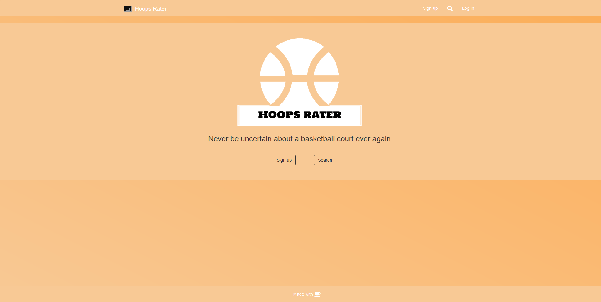
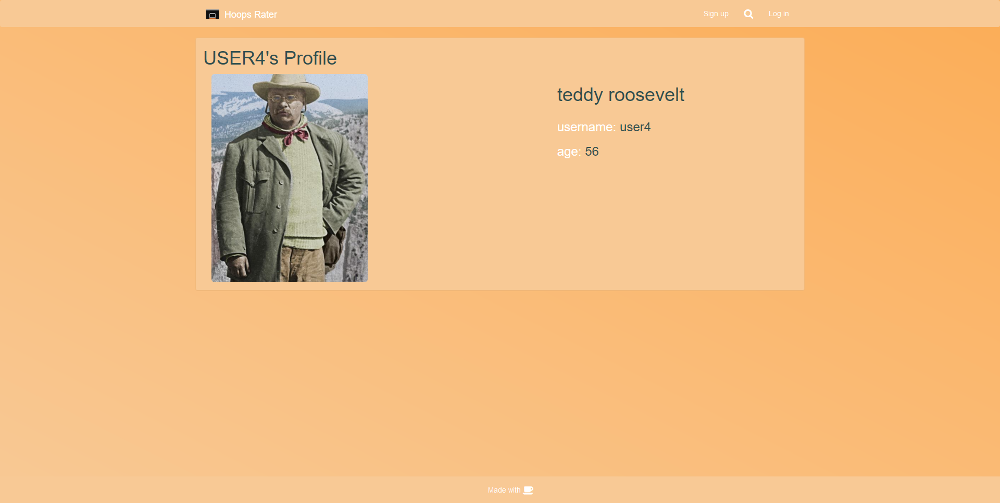
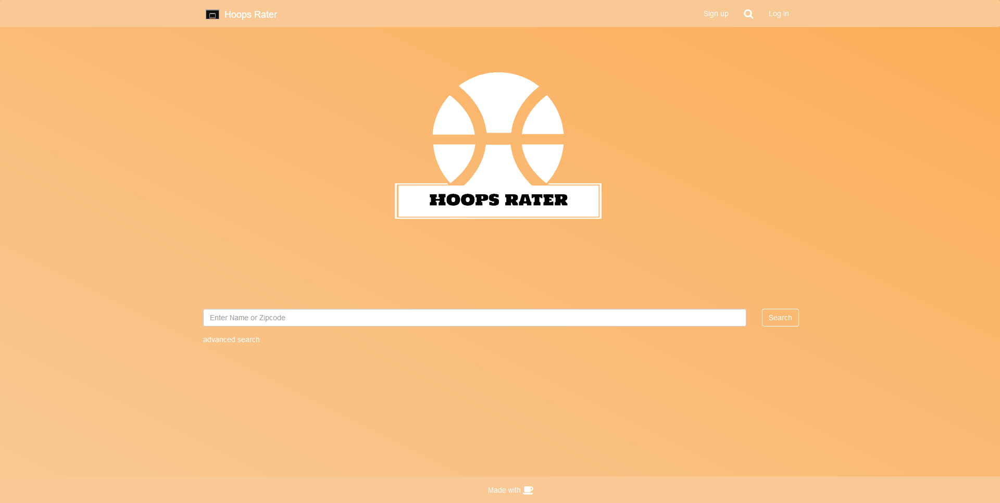
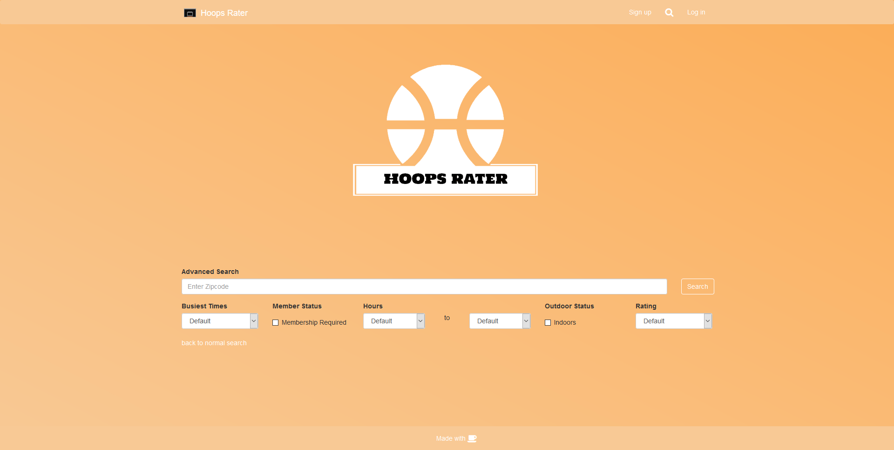
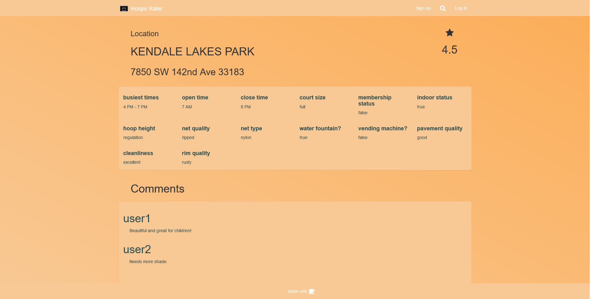
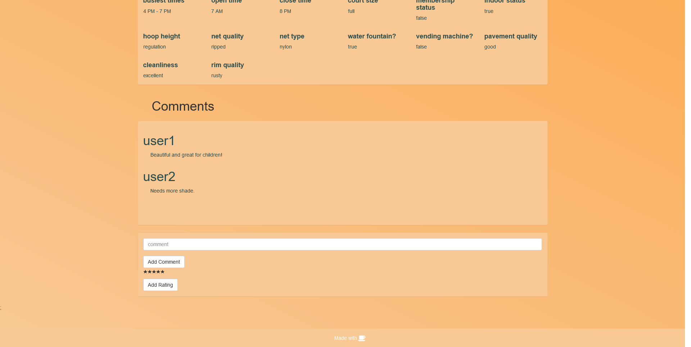

# Hoops: Court Rating Webapp

This application aims to use React to handle front-end components, Express to handle back-end routing, and PostgreSQL to handle information in order to provide an application that allows a user that is interested in their community's local basketball courts to rate and browse nearby basketball courts.

## Description - Documentation Update

After a long semester, the team was able to create a SPA that allows a user to sign up, log in, search for courts via a regular search or advanced search, and rate/comment on courts.
There were a lot of features that we had to trim from our scope, such as photo uploads, crowdsourced court information, and geolocation. Overall, the team was satisfied with the learning experiences and outcome of the project. Here are some screenshots of the product.














## Getting Started

For development, clone the repository into a directory on your machine using:

```
git clone <repository link>
```

### Installing

First, run ```yarn``` in the root of the repository to install the dependencies required for the back-end functionality. Run ```yarn``` in the /client directory to install the dependencies in there as well.

Make sure to run

```
npm i nodemon -g yarn
```

on your machine in order to have this process manager installed to run the application.

You'll notice a ```config.json``` file in the root directory; replace the template with your database information so that you are able to make a connection when the application runs.
There's also an ```auth-config.json``` in the root of the project, which holds the information for the Okta authentication, and an ```auth-config.js``` in the client/src/components folder for the same reason. You would want to configure these yourself in order to allow the authentication part of the project.

Head to your terminal and execute

```
yarn dev
```

to run an instance of the project on your localhost. Connect to the host as specified by your terminal to test functionality.

## Built With

* [React](https://github.com/facebook/react) - The front-end library
* [React Bootstrap](https://react-bootstrap.github.io/) - Front-end styling
* [Yarn](https://yarnpkg.com/en/) - Dependency Management
* [Express](https://github.com/expressjs/express) - Routing framework
* [GCloud](https://cloud.google.com/) - Database platform
* [Okta](https://developer.okta.com/) - Authentication service

## Contributing

In order to contribute, clone the repository and make sure to create your own branch using standard git naming conventions. Commit frequently and push when you make a decent feature change.

## Authors
### Florida International University CEN 4010 Group 2
Adrian Rodriguez - [totemc](https://github.com/totemc)

Joseph Nguyen - [JosephComputerScience](https://github.com/JosephComputerScience)

Oscar Padilla - [OAPadilla](https://github.com/OAPadilla)

Alex Campaneria - [ACampy](https://github.com/ACampy)

Amir Jindani - [amirjindani](https://github.com/amirjindani)
